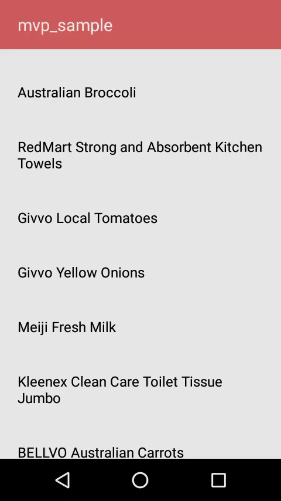

# RecyclerView-Pagination-using-MVP

* __What, Why and When of Pagination__: [Pagination](https://en.wikipedia.org/wiki/Pagination) is the process of dividing a document into discrete pages, either electronic pages or printed pages.

* __Why Pagination?__
  
  I’m sure you have a pretty good idea by now on when to use it. If you have a ton of content that takes too long to load. This can be either from a local database or an API call. Then it makes sense to use Pagination. If you’re pulling from a database, request data in batches (say 15 per request). The same also holds true for an API call.

# Getting Started

* __Android Pagination with RecyclerView__

        
        products_rclv.addOnScrollListener(new RecyclerView.OnScrollListener()
        {
            @Override
            public void onScrolled(RecyclerView recyclerView, int dx, int dy)
            {
                super.onScrolled(recyclerView, dx, dy);

                int visibleItemCount = linearLayoutManager.getChildCount();
                int totalItemCount = linearLayoutManager.getItemCount();
                int firstVisibleItemPosition = linearLayoutManager.findFirstVisibleItemPosition();

                if (!isLoading)
                {
                    if ((visibleItemCount + firstVisibleItemPosition) >= totalItemCount && firstVisibleItemPosition >= 0)
                    {
                        isLoading = true;

                        pageIndex++;

                        loadMoreItems();
                    }
                }
            }
        });
        
 * __NOTE:__
 
 The onScrolled() logic is the most important piece of your entire Pagination logic. So make sure you’re doing it right. The key snippet which contains the Pagination logic is as follows.
 
        if (!isLoading)
          {
              if ((visibleItemCount + firstVisibleItemPosition) >= totalItemCount && firstVisibleItemPosition >= 0)
              {
                  isLoading = true;

                  pageIndex++;

                  loadMoreItems();
              }
          }
          
          
 # Demo
       

# Basic MVP Sample

* __[MVP](https://github.com/yash786agg/MVP)__ - Basic Android Architecture MVP (Model View Presenter) pattern

# Prerequisites
* __Android Studio 3.0__
* __Android Device with USB Debugging Enabled__

# Built With

* __[Android Studio](https://developer.android.com/studio/index.html)__ - The Official IDE for Android
* __[Java](https://en.wikipedia.org/wiki/Java_(programming_language))__ - The Official Language for Android
* __[Gradle](https://gradle.org)__ - Build tool for Android Studio

Thanks for reading this repo. Be sure to click ★ below to recommend this repo if you found it helpful. It means a lot to me.

For more about programming, follow me on [Medium](https://medium.com/@yash786agg)

Also, Let’s become friends on [Linkedin](http://bit.ly/24t4EVI)
